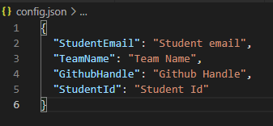
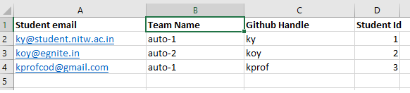

# Requirements

Open powershell in admin mode and run 
> .\PreRequisites.ps1

If you get an error saying **cannot be loaded because running scripts is disabled on this system** run 
> Set-ExecutionPolicy -ExecutionPolicy Unrestricted

and then run the above command

Once complete run : 
> python ./GithubAutomate.py

Ensure the names of the headings in the Excel sheet match to that of the values in config file as shown : 

Get the token from Postman and paste it when prompted
Enter the location of the Excel sheet and the sheet name when prompted.